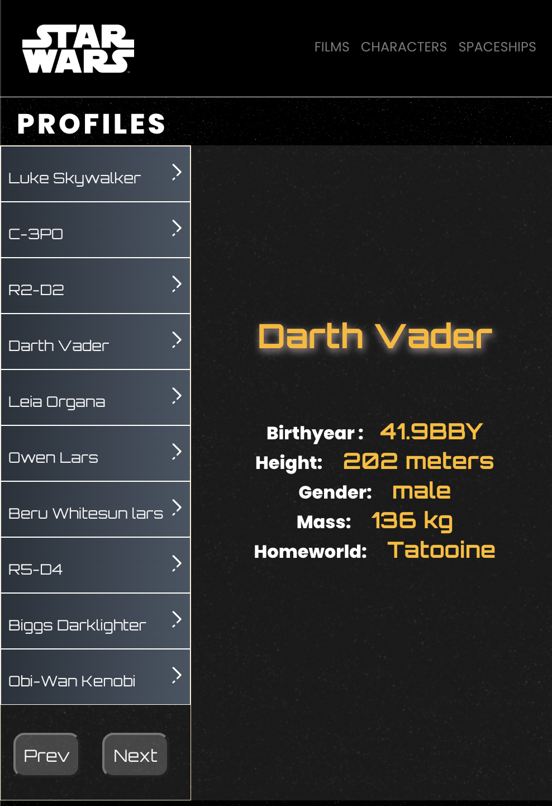
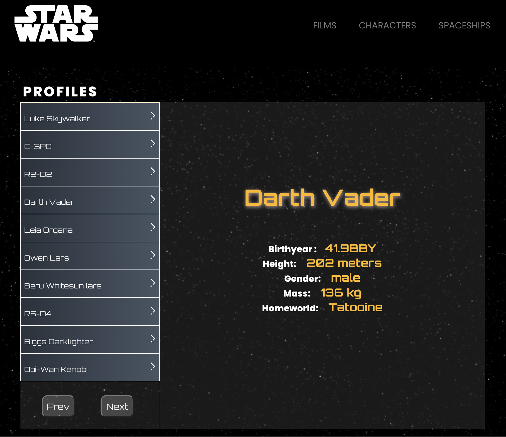
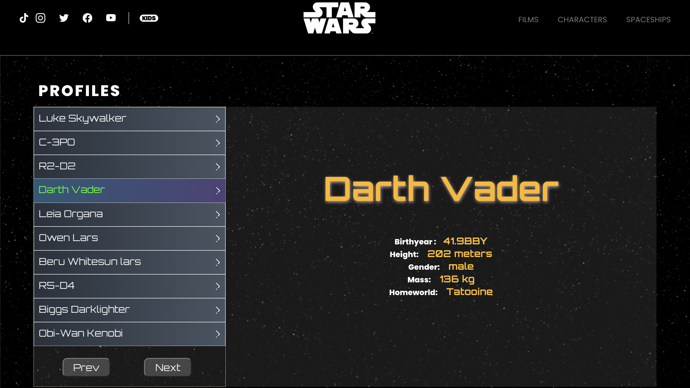

# React star wars app

## Project members

### Zachary Kuchar

### Temitope Balogun

### Lynette Cargo

# Description

### This is a star wars web site, based off star wars.com. Our goals were to have similar pages and functionality similar to pages on the site.

### We want to make a simliar home page, header and footer. Our other pages will load up data on the films, characters, and star ships

## WireFrame

  

## Component Hierarcgy

### Functional Components: (children) Home, Film, People, and Spaceship

### Class components: (Pages - Parents) Home, Film, People, and Spaceship

## APIs used

### Star Wars API - SWAPI - https://swapi.dev/

### OMDb API - https://www.omdbapi.com/

## MVP - (Minimum viable product)

### A Header that can appropriatly manuver to other without fail. Our pages, will also fetch from our API's where applicable and be able to load data.

## Post MVP

### Styling for the different pages. Take information from loaded from our API's and display it in a clear for users. Load different pages of the API
